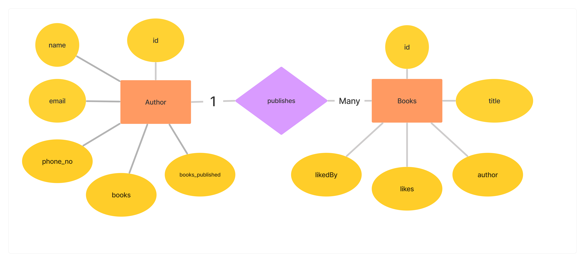
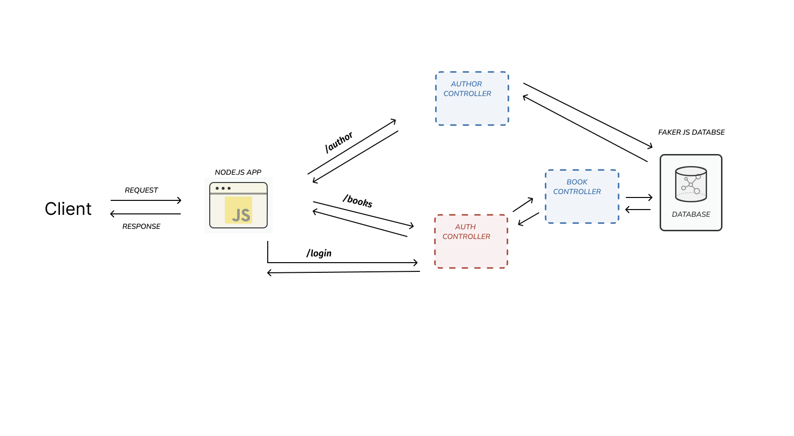

# Author Book Mvc Api

Api in Mvc architecture pattern


## Backend Architecture Design

- Entity RelationShip Diagram



- Architecture Diagram



## Endpoints

**The Endpoints are available on the postman documentaion**
```
https://documenter.getpostman.com/view/26905398/2s9YsKfrhq
```


## Features

- User Authentication
- Pagination
- Sorting
- Protected Routes


## Technologies Used

- Node.js 
- Express.js
- Javascript
- jsonwebToken 
- Faker.js

## Installation ⚡

**1. Clone this repo by running the following command :-**

```bash
 git clone 
 cd 
```

**2. Now install all the required packages by running the following commands :-**

```
npm install
```
**3.Fill in the required variable by making an config.env file in the root of project**

```
NODE_ENV=
PORT=
JWT_SECRET=
JWT_EXPIRES_IN=
JWT_COOKIE_EXPIRES_IN=
```

**4. Start the Development server by**

```
#before must Install the nodemon dependency before running in development environment
Start dev the server
npm run start:dev
```

**5.** **🎉 Open your browser and go to `https://localhost:<yourPortNumber>`**